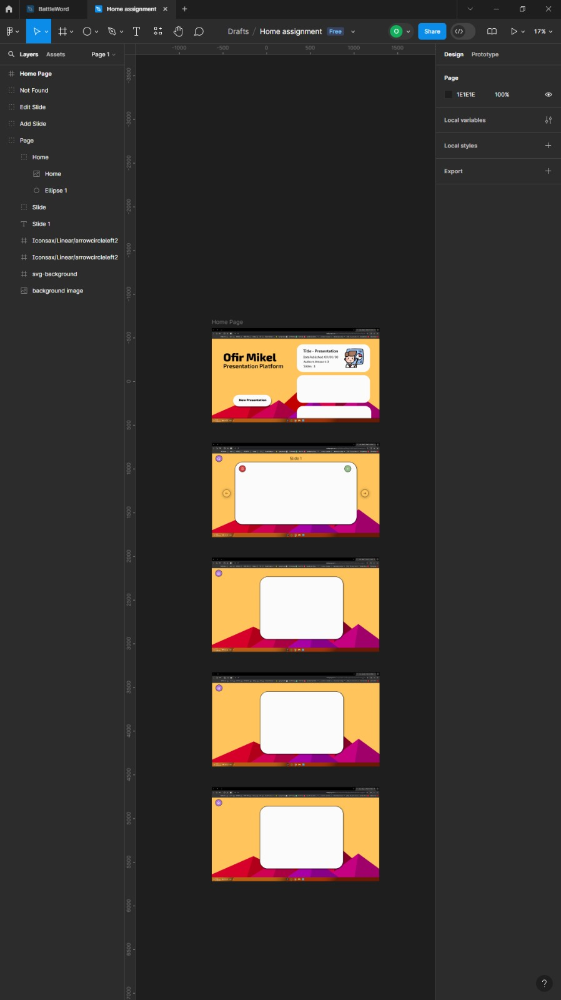
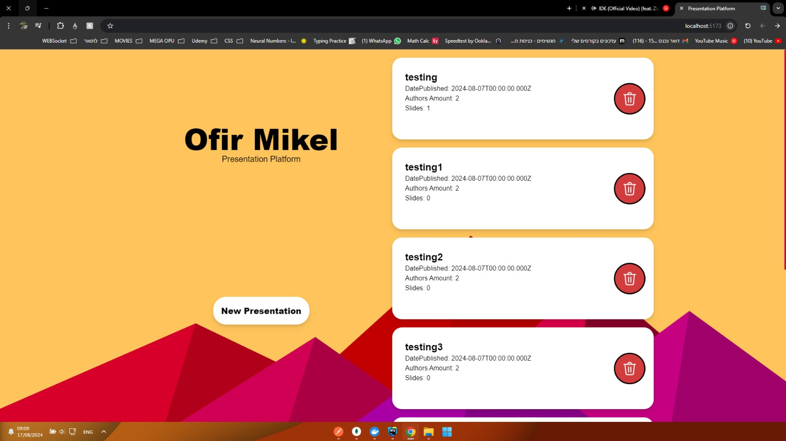
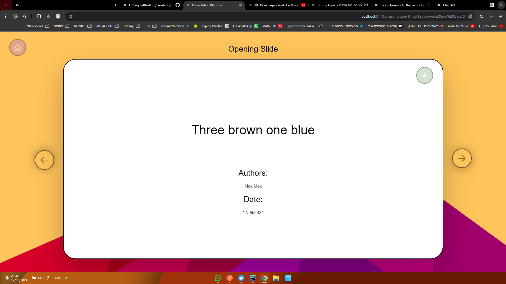
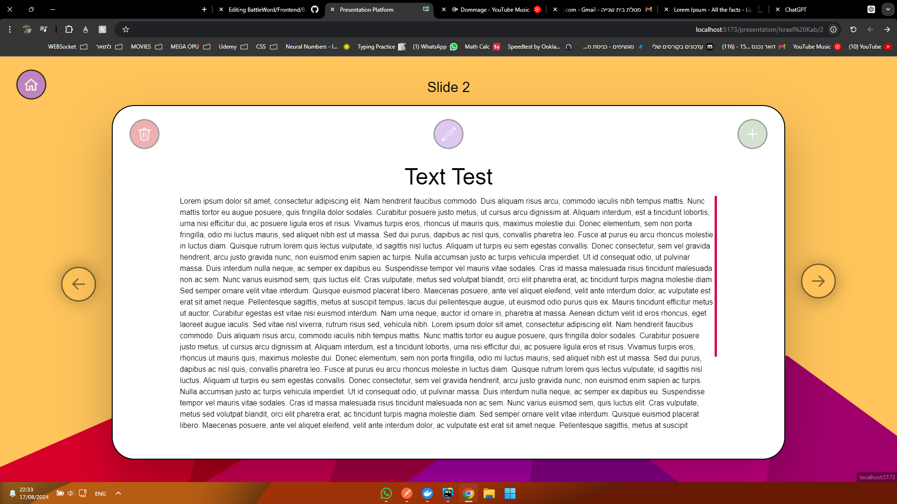
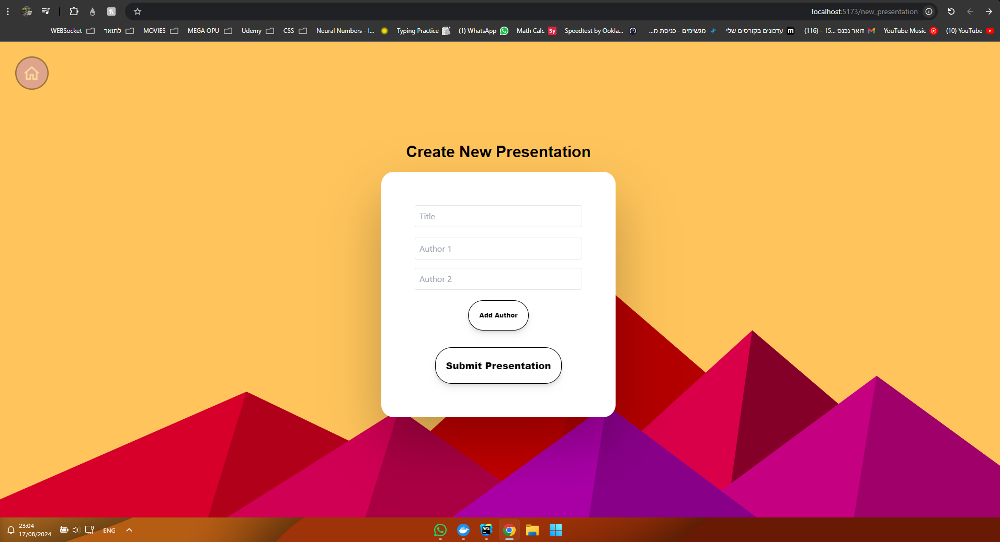
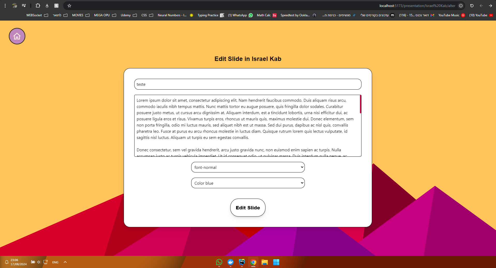
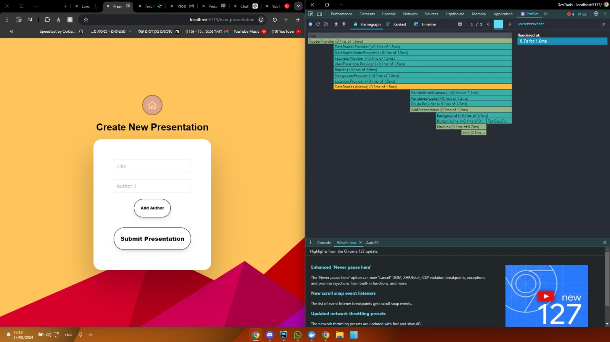

# Presentation Platform Frontend

Presentation Platform is a tool designed for managing and creating presentations 

## Table of Contents

- [Installation](#installation)
- [Usage](#usage)
- [Development](#development)
- [Build](#build)

## Installation

1. **Clone the repository**
   ```sh
   cd Frontend/BattleWord
   ```

2. **Install dependencies**
   ```sh
   npm install
   ```

## Usage

To start the development server, run:
```sh
npm run dev
```
This will start the application on `http://localhost:5173` by default.

## Development
   Created 5 pages in the website started by planing the pages in figma (General template:)
   
   #### page1 : Home
   Allow the user to view their presentations and delete any they choose.
   
   #### page2 : Opening Slide
   
   #### page3 : Slides
   
   #### page4 : Add Presentation
   
   #### page5 : Add / Edit Slide
   

   

   All pages have a mobile and laptop mode as well

### Directory Structure

```
Frontend/
├── public/             # Static assets
├── src/                # Source code
│   ├── assets/         # Images, fonts, etc.
│   ├── components/     # React components
│   ├── hooks/          # React Hooks
│   ├── loaders/        # Loader methods for react router dom
│   ├── types/          # Types Files Interfaces
│   ├── pages/          # Page components
│   ├── servics/        # Api controller
│   ├── utils/          # utility methods
│   ├── App.tsx         # Main App component
│   ├── vite-env.d.ts   # Vite Environment variables
│   └── main.tsx        # Entry point
│   └── index.css       # Css stylesheet 
├── index.html          # Main HTML file
└── Dockerfile          # Dockerfile image front


```

### Scripts

- **`npm run dev`**: Start the development server.
- **`npm run build`**: Build the project for production.
- **`npm run preview`**: Preview the production build locally.
- **`npm run lint`**: Run linter on the project files.

## Build
To create an optimized production build, run:
```sh
npm run build
```
The build output will be in the `dist` directory. You can deploy this directory to your web server.
- Alternatively, use Docker to run the entire project.

### Testing 
Preformed manual testing and testing using profiler  
