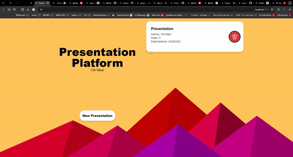

# Presentation Platform


## Table of Contents

- [Introduction](#introduction)
- [Features](#features)
- [Technologies](#technologies)
- [File Structure](#file-structure)
- [Installation](#installation)
- [Usage](#usage)


## Introduction

A Home Assignment given, creating a Server-Side Service for Presentation Platform.

## Features
- Creating a Presentation
- Showing all Presentations and their information
- Adding a Slide to a Presentation
- Altering a Slide
- Deleting a Slide
- Deleting Presentation

## Objects

- **Presentation obj contains:** 
  - id(unique) 
  - title(unique) 
  - authorsList 
  - datePublished
- **Slide obj contains:** 
  - id(unique)
  - presentation 
  - content  
  - style(style is an object).
- **style obj contains:** 
  - fontSize 
  - fontColor 
  - fontWeight 

## Technologies

- **Node.js**: JavaScript runtime
- **Express**: Web framework for Node.js
- **MongoDB**: NoSQL database
- **Mongoose**: MongoDB object modeling tool

## File Structure

```
presentation-platform/
│
├── assets/                            # Assets for Readme file
├── .env                               # Environment variables --only local need to be created when using the project.--
├── .gitignore                         # Files git ignores.
├── docker-compose.yaml                # Docker compose file
└── README                             # README file 

```
important files are `routes.js` , and the `js files in get, patch, put and post folders`
## Installation
### Using Docker

1. Ensure you have Docker installed on your machine. If not, download and install Docker from [here](https://www.docker.com/get-started).

2. Clone the repository:

    ```bash
    git clone https://github.com/OfirMikel/Presentation-Platform.git
    ```

3. Navigate to the project directory:

    ```bash
    cd presentation-platform
    ```

4. Build and run the Docker containers:

    ```bash
    docker-compose up --build
    ```

  This command will build the Docker images for your Node.js application and MongoDB, and start the containers. 

- MongoDB will be available at `mongodb://mongo:27017/yourdbname`.

- The API will be available at `http://localhost:5000`.

### Manual Installation

1. Clone the repository:

    ```bash
    git clone https://github.com/OfirMikel/Presentation-Platform.git
    ```
**Alternatively**, use the provided zip file and start from step 2.

2. Navigate to the project directory:

    ```bash
    cd presentation-platform
    ```

3. Install dependencies - need to be preformed for the Frontend folder and Backend folder:

    ```bash
    npm install
    ```

## Configuration

1. Create a `.env` file in the root of your project.

2. Add the following environment variables to your `.env` file:

    ```env
    PORT=5000
    MONGO_URI=mongodb://localhost:27017/yourdbname
    VITE_BASE_URL=http://localhost:5000
    ```
Disclaimer **yourdbname** is the db name that u should provide
## Usage

1. Start the server:

    ```bash
    npm start
    ```
2. Start the Frontend:

    ```bash
    npm run dev
    ```

3. The Website will be available at http://localhost:5173/

### Presentation of the website

- more information about the design can be found in the readme file inside Frontend
## Error Handling

