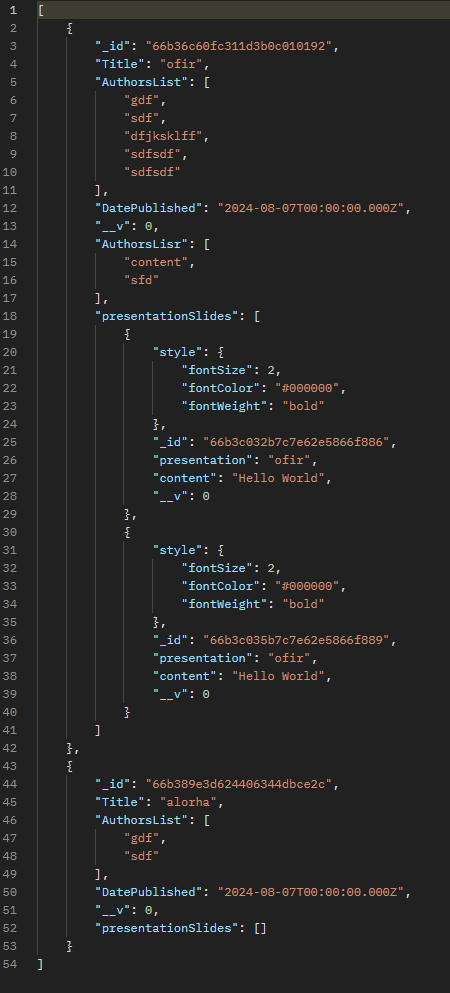
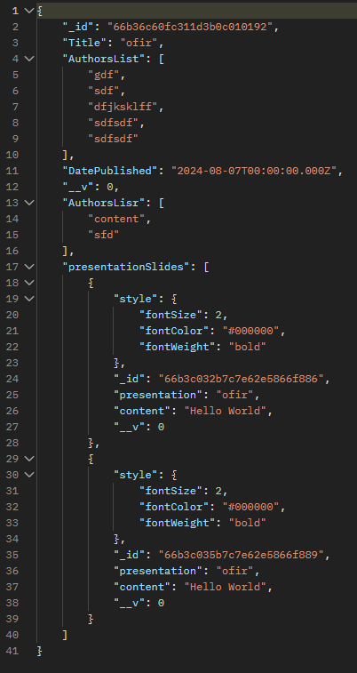
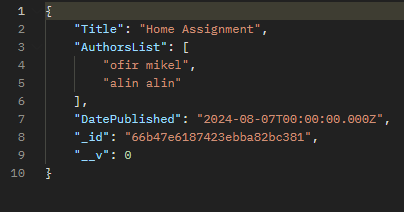
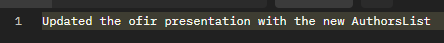
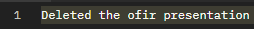
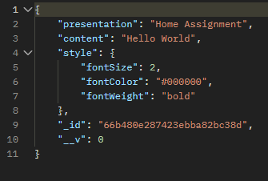
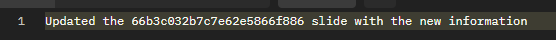
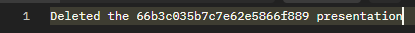
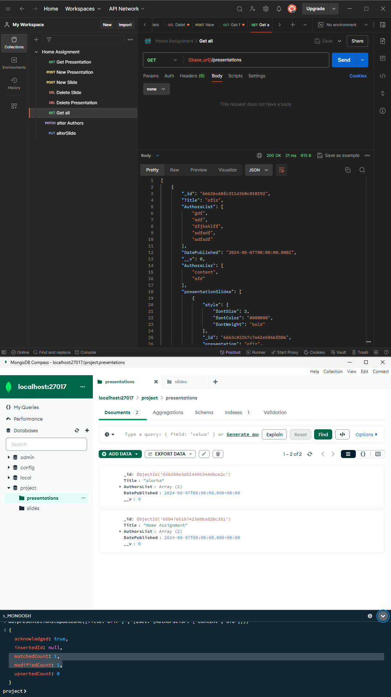

# Presentation Platform

## Table of Contents

- [Introduction](#introduction)
- [Features](#features)
- [Technologies](#technologies)
- [File Structure](#file-structure)
- [Installation](#installation)
- [Configuration](#configuration)
- [Usage](#usage)
- [API Endpoints](#api-endpoints)
- [Error Handling](#error-handling)

## Introduction

A Home Assignment given, creating a Server-Side Service for Presentation Platform.

## Features
- [Creating a New Presentation](#post-presentation)   
- [Fetch a Presentation by Title(Title is unique)](#get-presentationstitle)
- [Adding a Slide to a Presentation](#post-slide)
- [Altering a Slide](#put-slideid) 
- [Altering the Authors List](#patch-presentationauthorstitle) 
- [Deleting a Slide](#delete-slideid)
- [Delete Presentation](#delete-presentationtitle) 
- [Get All Presentations](#get-presentations)

## Objects

- **Presentation obj contains:** 
  - id(unique) 
  - title(unique) 
  - authorsList 
  - datePublished
- **Slide obj contains:** 
  - id(unique)
  - presentation 
  - content  
  - style(style is an object).
- **style obj contains:** 
  - fontSize 
  - fontColor 
  - fontWeight 

## Technologies

- **Node.js**: JavaScript runtime
- **Express**: Web framework for Node.js
- **MongoDB**: NoSQL database
- **Mongoose**: MongoDB object modeling tool

## File Structure

```
presentation-platform/
│
├── assets/                            # Assets for Readme file
│
├── models/
│   └── Presentation.js                # Presentation model schema
│   └── Slide.js                       # Slide model schema
│
├── routes/
│   ├── delete
│   │   └── deletePresentation.js      # methods for deleting a Presentation
│   │   └── deleteSlide.js             # methods for deleting a Slide
│   ├── get
│   │   └── getAllPresentions.js       # methods for reciving all Presentations
│   │   └── getPresentationByTitle.js  # methods for reciving a specifc Presentation
│   ├── patch
│   │   └── alterAuthors.js            # methods for changing a Presentation list of authors
│   ├── put
│   │   └── alterSlide.js              # methods for changing a Slide
│   ├── post
│   │   └── addPresentation.js         # methods for creating a new Presentation
│   │   └── postSlide.js               # methods for creating a new Slide
│   └── routes.js                      # registering routes for Presentation management
│
├── .env                               # Environment variables --only local need to be created when using the project.--
├── .gitignore                         # Git ignore file
├── Dockerfile                         # Dockerfile
├── docker-compose.yaml                # docker configuration 
├── app.js                             # Express app setup
├── test.postman_collection.json       # Express app setup
├── package.json                       # NPM dependencies and scripts
└── README.md                          # Project documentation
```
important files are `routes.js` , and the `js files in get, patch, put and post folders`
## Installation
### Using Docker

1. Ensure you have Docker installed on your machine. If not, download and install Docker from [here](https://www.docker.com/get-started).

2. Clone the repository:

    ```bash
    git clone https://github.com/OfirMikel/Presentation-Platform.git
    ```

3. Navigate to the project directory:

    ```bash
    cd presentation-platform
    ```

4. Build and run the Docker containers:

    ```bash
    docker-compose up --build
    ```

  This command will build the Docker images for your Node.js application and MongoDB, and start the containers. 

- MongoDB will be available at `mongodb://mongo:27017/yourdbname`.

- The API will be available at `http://localhost:3000`.

### Manual Installation

1. Clone the repository:

    ```bash
    git clone https://github.com/OfirMikel/Presentation-Platform.git
    ```
**Alternatively**, use the provided zip file and start from step 2.

2. Navigate to the project directory:

    ```bash
    cd presentation-platform
    ```

3. Install dependencies:

    ```bash
    npm install
    ```

## Configuration

1. Create a `.env` file in the root of your project.

2. Add the following environment variables to your `.env` file:

    ```env
    PORT=3000
    MONGO_URI=mongodb://localhost:27017/yourdbname
    ```
Disclaimer **yourdbname** is the db name that u should provide
## Usage

1. Start the server:

    ```bash
    npm start
    ```

2. The API will be available at : ``http://localhost:3000.``

## API Endpoints

### Presentation

- #### GET /presentations
- Get all presentation | expected output structure:
-  
- #### GET /presentations/:title
- Get presentation by Title | expected output structure:
- 
- #### POST /presentation
- Create a new presentation | expected output structure:
- 
- #### PATCH /presentation/authors/:title
- Update a presentation author list by Title | expected output structure:
- 
- #### DELETE /presentation/:title
- Delete a presentation by Title | expected output structure:
- 
### Slide

- #### POST /slide
- Create a new slide | expected output structure:
- 
- #### PUT /slide/:id
- Update a slide by ID | expected output structure: 
- 
- #### DELETE /slide/:id
- Delete a slide by ID | expected output structure:
- 

## Error Handling

Standard error responses:

- **400 Bad Request**: The request could not be understood or was missing required parameters.
- **500 Server Problems**: The DataBase wasn't found.

## TESTING
I conducted multiple tests using Postman, MongoDB Compass, and the MongoDB Shell.
therefore I provided the collection file for Postman.
## Postman and MongoDB Compass
1. Import Collection: Import the provided Postman collection (Assignment.postman_collection) into Postman.

2. Environment Variables: Set up environment variables in Postman for base_url and other necessary variables.

3. Run Requests: Execute requests to test API endpoints. Verify responses for correctness and expected behavior.


